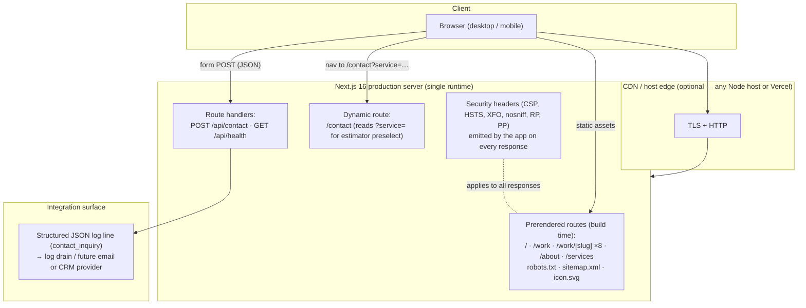

# design-brand-strategy — Master Project Architecture Document (PAD) v1.1.0

**Classification:** Internal Engineering Reference
**Status:** DEFINITIVE, PRODUCTION-LOCKED BLUEPRINT (ADR-011 supersedes ADR-002)
**Companion Documents:** `README.md` (public face), `CLAUDE.md` (agent working contract), `AGENTS.md` (compact agent onboarding)
**Last Updated:** 2026-09-13 — v1.1.0 adds Prisma SQLite (ADR-011), ContactInquiry persistence, and CI DB provisioning
**Audience:** Senior Engineers, Tech Leads, DevOps, and Onboarding Engineers
**Rule:** Every architectural decision in this document traces to a specific rationale. Nothing is here "because it's popular."

#### Revision Block — v1.0.0 (Initial)

- `[SR]` Initial document generated after production verification (build, 18 unit tests, lint, typecheck, API smoke test, visual QA).
- `[SR]` Contrast ratios in §5 measured programmatically (WCAG 2.1 relative-luminance formula), not estimated.

#### Revision Block — v1.1.0 (ADR-011)

- `[DB]` Supersede ADR-002 — add Prisma 6.19.3 + SQLite `db/custom.db` for `ContactInquiry` persistence (see `docs/ADR-011-prisma-sqlite.md`); add `db:*` scripts, `src/lib/wcc/db-url.ts` resolver, `src/lib/db.ts` singleton; wire `POST /api/contact` to `db.contactInquiry.create` (fail-open); provision `.env.example` `DATABASE_URL`; adapt `.github/workflows/verify-gate.yml` to `cp .env.example .env → db:generate → db:push` before the documented gate; update `tsconfig.json` exclude `scripts` + `e2e` for clean `typecheck`; bump tests 44→52 (new `db-url` contract tests).

### Table of Contents

1. [System Overview & Decisions](#1-system-overview--decisions)
2. [High-Level System Topology](#2-high-level-system-topology)
3. [Application Architecture](#3-application-architecture)
4. [Data Architecture](#4-data-architecture)
5. [Design System Reference](#5-design-system-reference)
6. [Security Architecture](#6-security-architecture)
7. [Testing Strategy](#7-testing-strategy)
8. [Build & Deployment](#8-build--deployment)
9. [Developer Handbook](#9-developer-handbook)
10. [Known Issues & Outstanding Tasks](#10-known-issues--outstanding-tasks)
11. [Key Files Reference](#11-key-files-reference)
12. [Glossary](#12-glossary)

---

## 1. System Overview & Decisions

### 1.1 Document Metadata & Purpose

This PAD is the single source of truth for the design-brand-strategy codebase: an editorial portfolio website for a designer & brand strategist persona, implemented as an original work (original code, original copy, AI-generated imagery) following the information architecture and design language of a reference site. New engineers should read §1–§3 first; anyone touching validation, headers, or the estimator should read §6 and §7 before writing code. The document describes current state only — it is not a roadmap.

### 1.2 Technology Stack Summary

| Layer | Technology | Version | Key Rationale |
|-------|-----------|---------|---------------|
| Web framework | Next.js (App Router) | 16.3.5 | SSG-first marketing site + route handlers in one runtime; foundation-repo toolchain parity |
| UI runtime | React | 19.3.0 | Required by Next 16; server-first rendering keeps client JS minimal |
| Language | TypeScript (strict) | 5.9.3 | Content-as-code demands compile-time guarantees; `any` banned by convention |
| Styling | Tailwind CSS | 4.3.3 | CSS-first token architecture matches the design-token strategy; zero runtime CSS-in-JS |
| PostCSS integration | @tailwindcss/postcss | 4.3.3 | Standard Tailwind v4 pipeline |
| Validation | zod | 3.25.76 | One schema shared by client form and API route — single validation contract |
| Icons | lucide-react | 1.45.0 | Tree-shakeable inline SVG; no icon font (CSP-friendly) |
| Unit testing | Vitest | 4.1.11 | Fast ESM-native runner; `@` alias parity with the app |
| Linting | ESLint (flat config) | 9.39.5 | `next/core-web-vitals` + react-hooks rules incl. `set-state-in-effect` as hard error |
| E2E | @playwright/test | 1.63.0 | 83 specs; chromium (153) + Pixel-7 projects against the production build |
| Persistence | Prisma + @prisma/client | 6.19.3 | Single `ContactInquiry` model on SQLite (ADR-011); shared `DATABASE_URL` resolver |
| Package manager | Bun | ≥ 1.1 (lockfile v1.3.14) | Fast installs; `bun.lock` committed as the lockfile |
| Database | SQLite via Prisma | 6.19.3 | Contact inquiries only (ADR-011); editorial content stays code (ADR-002 scope) |

### 1.3 Architecture Decision Records

**ADR-001: Next.js 16 App Router as the site framework**

- **Context:** A multi-page marketing site needing prerendered pages, a few dynamic interactive islands (estimator, form, theme), two API endpoints, and SEO metadata — built from the home-financing foundation repo (same toolchain).
- **Decision:** Next.js 16 App Router with Server Components by default; `"use client"` on exactly five leaf components (`site-header`, `theme-toggle`, `reveal`, `estimator`, `contact-form`).
- **Rationale:** Pages are prerendered at build (20 routes) with near-zero client JS outside the five islands; route handlers cover the API without a separate server; `generateStaticParams` maps the content-as-code project list onto static pages for free.
- **Consequences:** (+) Single runtime, SSG speed, minimal hydration cost. (−) App Router conventions and RSC constraints must be respected (no `window` in server components; params/searchParams are Promises in Next 16).
- **Alternatives Rejected:** Vite SPA (no prerender, manual routing/metadata); Astro (excellent fit but diverges from the foundation repo's toolchain); plain static HTML (no shared components, no API routes).

**ADR-002: No database — content-as-code**

- **Context:** Site content is persona copy, eight case studies, services, and estimator pricing. Editors are engineers (or an agent), not non-technical staff; there is no user-generated content except contact inquiries.
- **Decision:** All content lives in typed modules (`src/data/site.ts`, `src/data/projects.ts`); contact inquiries are accepted (202) and emitted as structured logs, not persisted. No ORM, no migrations, no CMS.
- **Rationale:** Removes an entire operational dependency (database, backups, secrets) from a site that doesn't need one; typed `readonly` data gives compile-time safety on content edits; inquiries remain actionable via the log-drain integration point.
- **Consequences:** (+) Zero DB ops, trivial deploys, fast builds. (−) Content edits require a code deploy; inquiry delivery requires wiring a provider at the documented integration point (§6.2).
- **Alternatives Rejected:** SQLite + Drizzle (foundation had it — dead weight for a portfolio); headless CMS (operational cost, content types don't warrant it); email-only form (no validation contract, no rate limiting).

**ADR-003: Tailwind CSS 4 CSS-first tokens + class-based dark mode**

- **Context:** The design language is the product: a warm cream/ink editorial palette with a dark counterpart, one serif/one sans family, and motion that must degrade safely.
- **Decision:** No `tailwind.config.js`. Tokens are CSS custom properties in `src/app/globals.css` (`:root` / `.dark`), exposed to utilities via `@theme inline`; dark mode via `@custom-variant dark (&:where(.dark, .dark *))`, toggled on `<html>` by a pre-hydration inline script and a `useSyncExternalStore`-based toggle.
- **Rationale:** Tailwind v4's intended architecture; palette changes are one-file edits; the class strategy allows a user override that survives reloads without a flash; self-hosted `next/font` pairs with `font-src 'self'` CSP.
- **Consequences:** (+) Single source of visual truth; no-flash dark mode; utilities stay semantic (`bg-background`, `text-muted-foreground`). (−) Contributors must know CSS-first config (no config file to grep); the inline theme script requires CSP `script-src 'unsafe-inline'` (as does Next's RSC payload — already unavoidable).
- **Alternatives Rejected:** `next-themes` (adds a dependency for ~20 lines of already-written code); media-only dark mode (no user override); styled-components/other CSS-in-JS (runtime cost, RSC friction).

**ADR-004: One zod schema, two enforcement points**

- **Context:** The inquiry form must validate client-side (fast feedback) and server-side (authority), and the error vocabulary must be identical in both places.
- **Decision:** `src/lib/contact.ts` exports the single `contactSchema` plus a `fieldErrors()` flattener; the client form and `POST /api/contact` both run it. The server additionally rate-limits (5 req / 10 min / IP) and treats a honeypot field as silent acceptance.
- **Rationale:** Duplication of validation logic is the classic source of drift between client hints and server rejections; a shared module makes the drift impossible and the contract testable in one place.
- **Consequences:** (+) One validation contract, unit-tested once. (−) Client bundle carries zod (~13 kB gzip) — acceptable for the authority it buys.
- **Alternatives Rejected:** HTML5 validation only (no custom messages, spoofable); server-only validation (poor UX); hand-rolled validators (untestable duplication).

**ADR-005: Deterministic rendering wherever hydration can observe**

- **Context:** The signature collage includes a dense pseudo-random character block, and the marquee assembles 24 items — both render on the server (SSG) and hydrate on the client.
- **Decision:** Randomness is a pure seeded function (`src/lib/char-block.ts`, LCG with fixed constants); the marquee sequence is derived deterministically from `PROJECTS`; the footer year is computed server-side only. No `Math.random()`/`Date.now()` in any render path.
- **Rationale:** Any non-determinism between SSG HTML and client hydration produces a mismatch warning and a re-render of the affected subtree — silent, intermittent, and embarrassing. Pure functions make it structurally impossible.
- **Consequences:** (+) Zero hydration mismatches by construction. (−) The character block is static per build (the intent — it is a texture, not entropy).
- **Alternatives Rejected:** `useEffect`-generated random text (flash of empty block, layout shift); `Math.random` with a seed library (unnecessary dependency).

**ADR-006: `images.unoptimized: true` while still using `next/image`, assets pre-encoded as WebP**

- **Context:** Nineteen originals (~54–255 kB each) drive the visual design. The build must run anywhere without native image codecs.
- **Decision:** `next.config.ts` sets `images.unoptimized: true`; all raster images still use `next/image` with explicit width/height and `object-cover`. Assets are committed as WebP (q85) rather than PNG.
- **Rationale:** Removes the sharp/libvips dependency from the runtime (portable builds/deploys, no postinstall surprises) while keeping `next/image`'s layout-stability and lazy-loading benefits. Source images are sized to their display slots (864×1152 portraits, 1344×840 landscape covers). Pre-encoded WebP keeps the format win without an optimizer; measured delta vs PNG was modest (2694 kB → 2442 kB, ~9%) because the editorial imagery compresses efficiently either way.
- **Consequences:** (+) Dependency-light, reproducible builds; smaller, modern-format assets. (−) No automatic responsive variants — a host with a native optimizer can still do better. OG consumers must support WebP (all major platforms do).
- **Alternatives Rejected:** Default optimizer (couples deploys to native binaries); hand-rolled `` (loses layout guarantees); keeping PNG (larger, no benefit measured).

---

**ADR-007: Fail-open no-JS reveal guards**

- **Context:** The `Reveal` component starts content at `opacity: 0` until its IntersectionObserver fires. Scripting-disabled visitors (and non-rendering crawlers) saw a hero-only page.
- **Decision:** Two independent CSS guards force `[data-reveal]` visible without JS: `html:not(.js) [data-reveal]` (the inline boot script adds a `js` class pre-paint — universal coverage, including browsers without `scripting` support) and `@media (scripting: none)` (CSS Media Queries Level 4; Chrome 120+/Safari 17+/Firefox 113+).
- **Rationale:** Both mechanisms fail open — if the script never runs, content is visible. No hydration-surface change: the guards live in CSS, the class is added before first paint, and the reduced-motion block is unchanged.
- **Consequences:** (+) No-JS users, crawlers, and pre-hydration snapshots see full content. (−) Two mechanisms to keep synchronized — pinned by source-reading tests so drift is caught in CI/local runs.
- **Alternatives Rejected:** JS-only check in the component (still invisible without JS); `noscript` style block (page-wide override, coarser).

---

**ADR-008: Mixed-aspect editorial image rhythm (content-as-code orientation fields)**

- **Context:** Uniform 3:2 landscape thumbnails homogenized the grids, marquee, and case studies — diverging from the reference site's alternating landscape/portrait rhythm and weakening the editorial identity.
- **Decision:** `Project.coverAspect` (`landscape` | `portrait`) and `details[].aspect` (`wide` | `landscape` | `portrait`) are data fields; render classes derive from them (`aspect-[8/5]`, `aspect-[4/5]`, `aspect-[7/3]`, `aspect-[3/2]`). Every case-study hero renders a uniform `aspect-[7/3]` wide banner regardless of cover orientation (pass-2 parity: source-measured 2.33 on every case page, object-cropped). Portrait artwork files follow a `-portrait` naming contract. The marquee derives item shapes (`tall` 4:5 / `wide` 5:4 / `landscape` 4:3 / square tiles) from the same data.
- **Rationale:** Orientation is a content decision (which image expresses this project), not a layout accident — so it belongs in the data layer where it is typed, tested (alternation and file-integrity invariants), and swappable without touching components.
- **Consequences:** (+) Grids alternate 1.60/0.80 exactly like the reference (pass-2 corrected from 0.75); detail imagery mixes wide banners and portrait studies; case heroes match the source's wide-banner grammar. (−) Adding a project now requires choosing an aspect and, for portraits, a 4:5-croppable source file; portrait covers carry a ≈6% render crop.
- **Alternatives Rejected:** CSS-only `nth-child` alternation (decouples layout from actual image orientation — crops random images); regenerating all covers as one aspect (loses the rhythm).

---

**ADR-009: Playwright e2e layer validating the production artifact**

- **Context:** The original verification story was unit tests plus manual smoke (curl + agent-browser probes). Visual/interaction parity facts lived in audit documents but had no executable regression guards, and dev-HMR hydration can diverge from the shipped build.
- **Decision:** Add a Playwright suite (`playwright.config.ts` + `e2e/*.spec.ts`, 83 specs) adapted from the home-financing reference: a managed `next start` webServer on :3002 validates the production build; projects are Desktop Chromium plus a Pixel-7 mobile-emulation project scoped to `mobile.spec.ts` (the responsive fork); workers are serial because contact-API tests mutate shared in-memory rate-limit state (tests spoof unique `x-forwarded-for` values — which isolates buckets **on self-managed origins only**, see the pass-4 amendment). Specs import `src/data/*` / `src/lib/*` directly so slugs, images, titles, and burst classification are data-driven. `@playwright/test` resolves to 1.63.0 (Chromium 153; bun.lock locks it — keep `playwright-core` deduped at exactly one copy, see pass 3).
- **Pass-4 amendment (P4-F1, environment awareness):** running the same suite against an edge-fronted external origin (`E2E_BASE_URL`, e.g. the live Cloudflare deploy) changes rate-limit semantics — AUD-1's `cf-connecting-ip`-first keying is unforgeable, so spoofed `x-forwarded-for` values collapse into one shared bucket and the isolation specs cannot (and must not) assert isolation from a single machine. The contact API specs therefore self-diagnose: `classifyBurstStatuses()` (pure, unit-tested in `src/lib/rate-limit.test.ts`) classifies the observed burst statuses as isolated/shared/broken; "shared" produces a loud in-body `test.skip` with the observed evidence, "broken" fails the spec everywhere, and the exact `[202×5, 429]` contract remains asserted on self-managed origins (the authoritative code-contract run; external runs are deploy-state validation). Re-runs against an external origin inside the 10-minute rate-limit window stay green instead of flaking. Deploy-state checks that belong to the operator's dashboard (email obfuscation, edge headers, live CLS) live in `scripts/live-deploy-audit.mjs`, not in the spec suite.
- **Rationale:** Parity and a11y contracts are only real if a machine re-checks them; testing the built artifact catches hydration/static-generation drift that unit tests cannot; the reference repo's config is a proven pattern worth converging on.
- **Consequences:** (+) Every audit finding now ships with a named regression guard; the security-header contract, SEO pins, and API discipline are pinned; the estimator and mobile nav are exercised end-to-end. (−) e2e adds ~40s to verification and requires the Chromium binary; with `javaScriptEnabled: false` Playwright locators cannot resolve, so no-JS specs assert through `page.evaluate` (documented in the spec header).
- **Alternatives Rejected:** Continuing with manual probes (not repeatable in CI); jsdom component tests (cannot validate the built artifact or a11y);
  parallel workers (rate-limit state races).

---

**ADR-010: Pass-2 parity redesign — static estimator form and editorial layout corrections**

- **Context:** The pass-2 verification audit (docs/AUDIT_VISUAL_PARITY.md § Pass 2) mechanically measured the source site and found the estimator was a static four-group form (not the assumed wizard), the /work index lacked its closing CTA band, portrait covers rendered 0.75 vs the source's 0.80, case heroes were per-project instead of uniform 7:3 wide banners, and several hero/grid compositions were inverted or stacked differently.
- **Decision:** Rebuild the estimator as a static four-group form (groups 1–4 always visible in a 2×2 column grid, estimate gated until all four groups are selected, `?service=` preselects one group); align contact to single-column fields with the form left / studio info right; make the referral field a select; render timeline labels with durations; adopt the source's measured geometry: portrait 4:5, uniform 7:3 case heroes, 3-column home services and about-approach grids, 5-step horizontal process (adding an original Refinement step), text-left/portrait-right home and about heroes, and the minimal card meta grammar (uppercase practice line + year).
- **Rationale:** Every change maps to a measured source-site fact (rendered geometry probes), not taste; the audit framework distinguishes design-language parity (fix) from content richness (keep).
- **Consequences:** (+) All twelve findings closed with e2e regression guards; estimator deep-links and math preserved. (−) The wizard's progressive disclosure is gone (source parity wins); case heroes crop portrait covers harder via `object-cover` (identical to source behavior); richer card summaries moved to case pages only.
- **Alternatives Rejected:** Keeping the wizard (interaction-model divergence from source); regenerating imagery at new aspect ratios (source itself object-crops its 1280×800 set; no need).

**ADR-011: Prisma SQLite for ContactInquiry persistence (supersedes ADR-002)**

- **Context:** ADR-002 left `POST /api/contact` log-only; `scripts/db.ts` + workflow assumed a DB that did not exist; Option B approved to persist inquiries without migrating editorial content.
- **Decision:** SQLite via Prisma 6.19.3, `file:../db/custom.db` re-anchored by `src/lib/wcc/db-url.ts` for CLI/runtime/standalone convergence, single `ContactInquiry` model (mirrors `contactSchema`, `cuid()` + `createdAt` indexes), `src/lib/db.ts` singleton, `db:*` scripts via `scripts/db.ts` wrapper, fail-open `db.contactInquiry.create` in `api/contact` (202 even if DB fails).
- **Rationale:** Minimal durable sink for the only write path; reuses the proven `car-care` resolver pattern; keeps content-as-code for `SERVICES`/`PROJECTS`.
- **Consequences:** (+) inquiries durable; CI provisions `db/custom.db` per run; (−) adds `prisma` deps, `db:generate` before `typecheck`/`build`, PII in `db/` (gitignored).
- **Alternatives Rejected:** Keep log-only (Option A); Drizzle; Postgres.

---

**ADR-012: Document-order HTML stream — no root loading boundary (remediation pass 3)**

- **Context:** Live-deploy validation (2026-09-14) measured cold-load CLS 0.31 on ~50–75% of first visits and `/work/<bogus-slug>` answering HTTP 200 with not-found content under `Cache-Control: s-maxage=31536000`. Root cause: the root `src/app/loading.tsx` created a Suspense boundary, so Next 16 streamed the layout shell (header + loading fallback + footer at byte ~6.9k) before the page content (byte ~14.9k+, `<!--$?-->` placeholder + hidden segment + `$RC` move-script). During chunked delivery (Cloudflare proxying the origin), Chrome painted the partial shell; the footer jumped ~5400px when content landed, and streamed `notFound()` rendered inside a 200 shell.
- **Decision:** Remove the root loading boundary entirely so prerendered pages stream as one document-ordered shell (footer byte 6981 → 39496, after the content); add `export const dynamicParams = false` to `/work/[slug]` so unknown slugs hard-404 at the router; pin both contracts with e2e specs (HTTP status + stream byte-order) and `scripts/cls-regression.mjs` (gap-proxy harness replaying the HTML with a 300ms mid-stream pause; worst CLS must stay ≤ 0.1).
- **Rationale:** All routes are static or near-instant (`/contact` reads only `searchParams`), so a loading fallback buys nothing; a full-viewport fallback experiment (`min-h-[calc(100dvh-4rem)]`) measured WORSE (CLS 0.45) and was rejected; document-order streaming fixes both defects at the mechanism level with a one-file deletion.
- **Consequences:** (+) CLS 0.0000 through the gap harness; real 404 status; no 1-year-cached soft-404s. (−) A future genuinely-slow dynamic route loses its loading fallback — reintroduce one only at the leaf route that needs it, and re-run the CLS harness; docs (README/CLAUDE/AGENTS/SKILL/PAD) pin the contract.
- **Alternatives Rejected:** Taller loading fallback (measured worse); moving `SiteFooter` into every page (duplication + error-page regressions); accepting the CLS (Core Web Vitals POOR on first visits).

---

## 2. High-Level System Topology



Runtime characteristics: the app is a single Node process (`next start`), stateless except the in-memory rate-limit map (per-instance, bounded at 10,000 keys — see §6.2). Static assets are served from `public/`. There are no external service dependencies, so the only failure modes are the host process and (optionally) the log drain.

---

## 3. Application Architecture

### 3.1 The Layer Model

```
Layer 0: src/data — typed content + configuration. Rule: no imports from layers above; everything is
         `readonly` and deterministic; this is the single source of truth for copy and pricing.
Layer 1: src/lib — pure logic. Rule: no React, no DOM, no fetch; every function is unit-testable;
         side-effectful utilities (rate-limit) are explicitly server-scoped by their consumers.
Layer 2: src/app + src/components — rendering. Rule: Server Components by default; "use client"
         only for interactivity; pages compose Layers 0–1 and never re-derive business rules.
```

**Golden rule:** dependencies point downward only (data → lib is not allowed; lib → data is, for
config tables the logic operates on; rendering may import from both). No layer reaches upward.

### 3.2 Annotated Directory Structure

```
design-brand-strategy/
├── AGENTS.md                        ← compact agent onboarding (commands, gotchas)
├── CLAUDE.md                        ← agent working contract (six-phase workflow, standards)
├── README.md                        ← public-facing project document
├── Project_Architecture_Document.md ← this file
├── package.json                     ← scripts: dev/build/start/test/lint/typecheck
├── bun.lock                         ← committed lockfile (Bun is the package manager)
├── next.config.ts                   ← security headers; images.unoptimized
├── tsconfig.json                    ← strict, @/* → ./src/*, excludes skills-like dirs
├── eslint.config.mjs                ← flat config, next/core-web-vitals
├── vitest.config.ts                 ← node env, @ alias parity
├── postcss.config.mjs               ← @tailwindcss/postcss only
├── .env.example                     ← NEXT_PUBLIC_SITE_URL
├── public/
│   └── images/                      ← 19 generated WebP originals (~2.5 MB, portraits, covers, details)
└── src/
    ├── app/
    │   ├── layout.tsx               ← fonts (Instrument Serif + Inter), theme script, shell
    │   ├── globals.css              ← design tokens (@theme inline), dark mode, motion guards
    │   ├── page.tsx                 ← home: hero, collage, marquee, work, about, services, CTA
    │   ├── error.tsx                ← client error boundary with reset
    │   ├── not-found.tsx            ← branded 404
    │   ├── (no loading.tsx          ← deliberately absent: root loading boundary
    │   │                              split the HTML stream and caused cold-load
    │   │                              CLS 0.31 + soft-404s — ADR-012)
    │   ├── icon.svg                 ← favicon (app-router auto-served)
    │   ├── sitemap.ts               ← 5 static + 8 project routes
    │   ├── robots.ts                ← allow all, disallow /api/, sitemap link
    │   ├── work/
    │   │   ├── page.tsx             ← work index (8 projects)
    │   │   └── [slug]/page.tsx      ← SSG case studies + sticky meta + next-project
    │   ├── about/page.tsx           ← bio, approach, recognition, beyond-work
    │   ├── services/page.tsx        ← six numbered practices + estimate links
    │   ├── contact/page.tsx         ← estimator + form (dynamic: reads ?service=)
    │   └── api/
    │       ├── contact/route.ts     ← POST: zod + rate limit + structured log (202/400/429)
    │       └── health/route.ts      ← GET: liveness probe
    ├── components/
    │   ├── site-header.tsx          ← sticky nav, mobile overlay, theme toggle [client]
    │   ├── site-footer.tsx          ← 3-column editorial footer [server]
    │   ├── theme-toggle.tsx         ← useSyncExternalStore + MutationObserver [client]
    │   ├── reveal.tsx               ← IntersectionObserver scroll reveal [client]
    │   ├── marquee.tsx              ← 24-item CSS-animated strip [server]
    │   ├── collage-strip.tsx        ← staggered collage + character block [server]
    │   ├── project-card.tsx         ← image-led project card [server]
    │   ├── estimator.tsx            ← static 4-group estimator form over pure pricing math [client]
    │   ├── contact-form.tsx         ← zod-validated inquiry form + honeypot [client]
    │   └── ui.tsx                   ← Container / SectionLabel / ArrowLink / PillLink [server]
    ├── data/
    │   ├── site.ts                  ← persona, nav, services, estimator config, awards, approach
    │   └── projects.ts              ← 8 case studies, featured set, marquee assembly, lookups
    └── lib/
        ├── estimator.ts             ← pure pricing math + formatters (+ .test.ts)
        ├── contact.ts               ← shared zod schema + fieldErrors (+ .test.ts)
        ├── char-block.ts            ← deterministic seeded LCG text
        └── rate-limit.ts            ← bounded in-memory sliding window
```

### 3.3 Critical Code Patterns

**Pattern 1 — Pure pricing math at the boundary (hydration-safe interactivity)**

```typescript
// src/lib/estimator.ts — the estimator UI is a thin projection of this function.
export function estimateRange(selection: EstimatorSelection): EstimateRange {
  const service = ESTIMATOR_SERVICES.find((s) => s.id === selection.serviceId);
  // … find stage / timeline / scope identically …
  if (!service) throw new RangeError(`Unknown estimator service: ${selection.serviceId}`);
  // Fail fast: the UI can only emit valid ids, so an invalid id is a programmer error.
  const multiplier = stage.multiplier * timeline.multiplier * scope.multiplier;
  return { low: roundToNearest(service.baseLow * multiplier, ROUND_TO),
           high: roundToNearest(service.baseHigh * multiplier, ROUND_TO),
           multiplier: Number(multiplier.toFixed(4)) };
}
```

*Why this pattern:* the estimator's selection state lives in leaf-local `useState`; every visible number is
derived via `estimateRange(selection)` once the selection is complete. Business rules never live in
the component, so they are testable without rendering and identical on server and client.

**Pattern 2 — Deterministic pseudo-randomness for SSR-observable content**

```typescript
// src/lib/char-block.ts — LCG with fixed constants; same seed ⇒ same text, forever.
let state = safeSeed % LCG_M;
for (let r = 0; r < safeRows; r++) {
  let line = "";
  for (let c = 0; c < safeCols; c++) {
    state = (LCG_A * state + LCG_C) % LCG_M;
    line += CHARSET[Math.floor((state / LCG_M) * CHARSET.length)];
  }
  lines.push(line);
}
```

*Why this pattern:* `Math.random()` in a server-rendered component guarantees hydration
mismatches. The seeded generator renders identically in SSG HTML and the client (ADR-005).

**Pattern 3 — External DOM state via `useSyncExternalStore`**

```tsx
// src/components/theme-toggle.tsx — <html>.classList is the store.
function subscribe(onChange: () => void) {
  const observer = new MutationObserver(onChange);
  observer.observe(document.documentElement, { attributes: true, attributeFilter: ["class"] });
  return () => observer.disconnect();
}
const dark = useSyncExternalStore(subscribe, getSnapshot, getServerSnapshot);
```

*Why this pattern:* the theme class is written by the pre-hydration script and this toggle —
an external system, not React state. `useSyncExternalStore` is the sanctioned bridge and the
only way that passes the repo's `set-state-in-effect` lint rule.

**Pattern 4 — Shared validation contract**

```typescript
// src/lib/contact.ts — imported by BOTH the client form and the API route.
export const contactSchema = z.object({ /* … trimmed, bounded fields … */ });
export function fieldErrors(error: z.ZodError): Record<string, string> { /* first issue per field */ }
```

*Why this pattern:* one schema defines the error vocabulary everywhere; the API's 400 body
(`{ ok: false, errors }`) is the same shape the client computes locally, so server rejections
render inline without translation (ADR-004).

**Pattern 5 — Motion as progressive enhancement**

```css
/* src/app/globals.css — the last line of defense for reduced motion. */
@media (prefers-reduced-motion: reduce) {
  .animate-marquee { animation: none !important; }
  [data-reveal] { opacity: 1 !important; transform: none !important; }
}
```

*Why this pattern:* JS-level checks race hydration and miss snapshot renderers; a CSS guard
means content can never depend on JavaScript firing to become visible.

---

## 4. Data Architecture

Editorial content is code (ADR-002 scope); contact inquiries persist to
SQLite via Prisma (ADR-011). The content data layer is code:

| Module | Contents | Consumers |
|--------|----------|-----------|
| `src/data/site.ts` | Persona/nav constants; 6 services (includes, best-for, estimator link); estimator config (4 services with base ranges, stage/timeline/scope multipliers); approach principles; awards; beyond-work | Home, services, contact, about, `lib/estimator` |
| `src/data/projects.ts` | 8 `Project` records (slug, meta, services, deliverables, overview/challenge/solution/outcome, detail images); featured filter; `getProject`; `getNextProject` (wraps); `getMarqueeItems()` (24-item assembly) | Home, work index, case studies, marquee, sitemap |

Invariants: every project slug is unique (SSG key); `featured` flags exactly four projects (home
grid); the marquee assembly totals 24 items (8 covers + 5 details + 11 typographic tiles);
`getNextProject` wraps around the array so navigation never dead-ends. Contact inquiries are the
only user-generated data and are intentionally non-persisted (§6.2).

---

## 5. Design System Reference

### 5.1 Typographic System

| Role | Face | Weights | Usage rules |
|------|------|---------|-------------|
| Display / headings | Instrument Serif (`--font-instrument-serif`) | 400 + italic | Headlines and pull quotes; italic used for emphasis phrases (`<em>`); sizes via `clamp()` — hero `clamp(3rem,8vw,6.5rem)`, page titles `clamp(2.5rem,6vw,4.5rem)` |
| Body / UI / labels | Inter (`--font-inter`) | variable | Body 14–16px; labels 10–13px uppercase `tracking-[0.18em–0.22em]`; tabular numerals (`tabular-nums`) for years, prices, indices |

Both self-hosted through `next/font` with `display: swap`; fallbacks Georgia / system sans.

### 5.2 Color Tokens

| Token | Light | Dark | Measured contrast on `background` | Usage |
|-------|-------|------|-----------------------------------|-------|
| `--background` | `#fbfaf9` | `#141414` | — | Page surface |
| `--foreground` | `#1a1a1a` | `#f5f4f0` | 16.69:1 / 16.74:1 (AAA) | Primary text, pill background |
| `--muted-foreground` | `#737373` | `#a3a3a3` | 4.55:1 (AA) / 7.30:1 (AAA) | Captions, metadata, labels |
| `--muted` | `hsl(45 8% 92%)` | `hsl(0 0% 14%)` | — | Option hover fill, estimate panel |
| `--accent` | `#e3e1dd` | `hsl(0 0% 16%)` | fg-on-accent 13.33:1 (AAA) | Character block, texture surfaces |
| `--border` | `hsl(40 10% 88%)` | `hsl(0 0% 20%)` | — | Hairline rules (1px, never heavier) |
| `--pill` / `--pill-foreground` | ink / cream | inverted | — | Availability badge on portrait |

Ratios computed with the WCAG 2.1 relative-luminance formula. Muted foreground is reserved for
captions/metadata at small sizes — primary copy always uses `--foreground`.

### 5.3 Component Primitives

No third-party UI kit. Primitives in `src/components/ui.tsx`: `Container` (max-w-[1400px], fixed
horizontal rhythm), `SectionLabel` (tiny uppercase tracking), `ArrowLink` (underline-grow + arrow
nudge), `PillLink`. Interactive controls (estimator options, form fields) use border-and-fill
patterns consistent with the editorial language: 1px borders, no shadows, no radii except pills.

### 5.4 Motion / Animation

| Name | Definition | Reduced-motion behavior |
|------|-----------|--------------------------|
| `marquee` | 56s linear `translateX(0 → -50%)` loop; hover pauses via `animation-play-state` | `animation: none` |
| Reveal | 300ms `opacity/translate` transition triggered by `IntersectionObserver` (rootMargin `-10%` bottom) | `[data-reveal]` forced visible in CSS |
| `link-underline` | 300ms `background-size 0%→100%` on 1px underline | Ornamental only (hover-gated) |

Motion rules: nothing animates layout-affecting properties on scroll except the marquee track
(`will-change: transform`); content visibility never depends on animation completing (Pattern 5).

---

## 6. Security Architecture

### 6.1 Security Rules

| # | Rule | Enforcement |
|---|------|-------------|
| 1 | CSP: `default-src 'self'`; scripts/styles `'unsafe-inline'` (Next RSC + next/font requirement); `img-src 'self' data: blob:`; `object-src 'none'`; `frame-ancestors 'none'`; `form-action 'self'` | `next.config.ts` headers, all routes |
| 2 | HSTS `max-age=63072000; includeSubDomains; preload` | `next.config.ts` headers |
| 3 | `X-Frame-Options: DENY`, `X-Content-Type-Options: nosniff`, `Referrer-Policy: strict-origin-when-cross-origin`, `Permissions-Policy: camera/mic/geolocation = ()` | `next.config.ts` headers |
| 4 | All API input validated with shared zod schema; bounded field lengths | `src/app/api/contact/route.ts` + `src/lib/contact.ts` |
| 5 | Per-IP rate limit: 5 requests / 10 minutes, `Retry-After: 600` on 429 | `src/lib/rate-limit.ts` |
| 6 | Memory-bounded limiter: ≤ 10,000 keys, expired sweep before insert | `src/lib/rate-limit.ts` (`MAX_BUCKETS`) |
| 7 | Honeypot field (`website`) silently accepted, never stored | `src/components/contact-form.tsx` |
| 8 | No secrets in repo: `.env*` ignored; SSH keys live outside the tree | `.gitignore` |
| 9 | Inquiry logs emit field metadata (lengths), never raw message bodies in full | `route.ts` structured log |

### 6.2 Security Utilities Inventory

`src/lib/rate-limit.ts` — sliding window with bounded map (anti-flood: spoofed
`x-forwarded-for` cannot grow the map unbounded). `src/lib/contact.ts` — schema authority.
`src/app/api/contact/route.ts` — the structured `contact_inquiry` log line is the documented
integration point for production delivery (email/CRM); it intentionally caps what it records.

### 6.3 Authentication & Authorization

None — public marketing site. No sessions, no cookies, no PII beyond the inquiry payload. The
API surface accepts only the contact payload and answers health checks.

### 6.4 Threat Model

| Vector | Mitigation |
|--------|-----------|
| Form spam / scripted floods | Rate limit (R5) + honeypot (R7) + zod bounds |
| Header-injection via proxy (`x-forwarded-for`) | Bounded map (R6); key is best-effort, limit is the guard |
| XSS via form content | React escaping; no `dangerouslySetInnerHTML` on any user path (the one usage — the theme script — is a fixed string in layout) |
| Clickjacking | `frame-ancestors 'none'` + `X-Frame-Options: DENY` |
| MIME sniffing | `nosniff` |
| Enumeration of /api | Nothing to enumerate: two routes, one writable, both rate-limited or trivial |

---

## 7. Testing Strategy

### 7.1 Test Distribution

| Category | Files | Tests | Location | Framework |
|----------|-------|-------|----------|-----------|
| Estimator math | 1 | 9 | `src/lib/estimator.test.ts` | Vitest (node env) |
| Contact schema + labels | 1 | 11 | `src/lib/contact.test.ts` | Vitest (node env) |
| Data contracts (aspects, marquee, process, FAQ) | 2 | 16 | `src/data/projects.test.ts`, `src/data/site.test.ts` | Vitest (node env) |
| No-JS/skip-link markup guards | 1 | 5 | `src/lib/reveal-guard.test.ts` (source-reading) | Vitest (node env) |
| Sitemap determinism | 1 | 3 | `src/app/sitemap.test.ts` | Vitest (node env) |
| DATABASE_URL resolver contract | 1 | 8 | `src/lib/wcc/__tests__/db-url.test.ts` | Vitest (node env) |
| Rate limit (client-key trust order + burst classifier) | 1 | 19 | `src/lib/rate-limit.test.ts` | Vitest (node env) |
| API contract | — | pinned in e2e | `e2e/contact.spec.ts` (202/400/429/405, per-field errors, environment-aware skips) | Playwright |
| Route health / headers / hard-404 / stream order | — | pinned in e2e | `e2e/smoke.spec.ts` + `scripts/live-deploy-audit.mjs` (deploy state) | Playwright + node script |
| Visual / interaction | — | pinned in e2e + audits | `e2e/parity.spec.ts`, `e2e/estimator.spec.ts`, `e2e/mobile.spec.ts`, `e2e/assets.spec.ts`, `e2e/seo.spec.ts`; VLM+geometry audits in `docs/AUDIT_VISUAL_PARITY.md` | Playwright |

### 7.2 Test Patterns

Unit tests target pure functions with expectations derived from the config tables and the
arithmetic written beside each assertion (e.g. "Established 1.2 × Standard 1.1 × Full System
1.3 = 1.716; 30000×1.716 = 51480 → 51000"). Schema tests enumerate: valid baseline, each invalid
field, optional defaults, trimming, and the `fieldErrors` flattening contract the API and form
share. The fail-fast contract is tested explicitly (`RangeError` on unknown ids).

### 7.3 Coverage Thresholds

No numeric gate is configured; the standard is: **every branch of `src/lib` logic is exercised**
and **every data-layer contract is pinned by tests** (currently 71 tests across 8 files covering
the estimator, the schema + label maps, project aspect invariants, services/FAQ data, sitemap
determinism, the no-JS markup guards, the DATABASE_URL resolver, the rate-limit
client-key trust order, and the burst-status environment classifier that backs the
edge-fronted e2e skip logic). Rendering is covered by the build's
prerender step (a page that fails to render fails the build).

### 7.4 Pre-PR / Pre-Deploy Checklist

- [ ] `bun run lint` — zero errors
- [ ] `bun run typecheck` — zero errors
- [ ] `bun run test` — all green (71/71 at pass 4)
- [ ] `bun run build` — compiles; expected route table printed (20 routes)
- [ ] Content changes: `curl` the affected route; scroll before screenshotting (reveal pattern)
- [ ] API changes: smoke 202/400/(429 if limiting touched) + verify security headers still present
- [ ] After deploy (live origin): `bun scripts/live-deploy-audit.mjs` — health, security headers,
      hard-404, robots, email-obfuscation OFF, cold-load CLS ≤ 0.1 (P4-F2)

---

## 8. Build & Deployment

### 8.1 Production Build

```bash
bun install
bun run build     # compile + typecheck + prerender 20 routes into .next/
bun run start     # serve on :3000 ( -p <port> to override )
```

Output: static HTML for 13 page routes (+ generated sitemap.xml, robots.txt, icon.svg) and
server bundles for `/contact`, `/api/*`. Build time observed: ~15s (10.5s compile + 4.4s TS) on
the reference container.

### 8.2 Environment Variables

| Name | Required | Description | Default |
|------|----------|-------------|---------|
| `NEXT_PUBLIC_SITE_URL` | No | Canonical origin for `metadataBase`, sitemap, robots, OG/Twitter URLs | `http://localhost:3000` |

### 8.3 Docker Configuration

None. Deliberately container-optional: the app is a plain Node server with no native deps
(ADR-006), so any Node 20+ host or serverless platform runs it as-is.

### 8.4 CI/CD Pipeline

Not yet configured (§10). The local equivalent gate is §7.4. When CI is added, the natural gate
sequence is `lint → typecheck → test → build` with artifact deploy on `main`.

---

## 9. Developer Handbook

### 9.1 Local Setup

```bash
git clone git@github.com:nordeim/design-brand-strategy.git && cd design-brand-strategy
bun install          # ~5s; bun.lock is committed — don't switch package managers
bun run dev          # http://localhost:3000
```

Optional: `cp .env.example .env.local` and set `NEXT_PUBLIC_SITE_URL` when testing metadata.

### 9.2 Common Commands

| Command | Location | Purpose |
|---------|----------|---------|
| `bun run dev` | repo root | Dev server with HMR |
| `bun run build` / `start` | repo root | Production build / serve |
| `bun run test` | repo root | Unit tests |
| `bunx vitest run <name>` | repo root | Single file / `-t` name filter |
| `bun run lint` / `lint:fix` | repo root | ESLint |
| `bun run typecheck` | repo root | `tsc --noEmit` |

### 9.3 Code Style Rules

Enforced: ESLint flat config (`next/core-web-vitals`, `react-hooks/set-state-in-effect` as
error), TypeScript strict. By convention: content in `src/data` only; pure logic in `src/lib`
(no React imports); `"use client"` only in the five designated components; semantic color
utilities over raw values; deterministic render paths only (ADR-005).

### 9.4 Git Workflow

`main` is the release branch (remote: `git@github.com:nordeim/design-brand-strategy.git`, SSH).
Branches: `feat/<topic>`, `fix/<topic>`, short-lived. Conventional Commits, atomic commits,
bodies explain "why". The first commit on `main` is the repository owner's prompt stub
(`docs/prompt-to-create.md`) — preserve it. Never commit secrets or keys.

---

## 10. Known Issues & Outstanding Tasks

| Priority | Issue | Impact | Status |
|----------|-------|--------|--------|
| HIGH | Contact inquiries are logged, not delivered — email/CRM provider must be wired at the `contact_inquiry` log line (`src/app/api/contact/route.ts`) | Production inquiries unreachable without integration | Open (documented integration point) |
| MEDIUM | Cloudflare **Email Address Obfuscation is ON** on the live zone (dashboard → Scrape Shield) — rewrites `studio@elenavance.com` into `/cdn-cgi/l/email-protection` spans (hydration-mismatch + `[email protected]` flash risk, README § Deployment). Operator dashboard action; machine-checked by `scripts/live-deploy-audit.mjs` (`email-obfuscation` check) | Potential hydration mismatch on live; broken mailto for no-JS visitors | Open (operator action; audit exits red until flipped) |
| MEDIUM | No CI pipeline — quality gates are local-only (§7.4) | Gate adherence depends on discipline | Open |
| LOW | In-memory rate limit is per-instance | Limit is N×5 with N instances behind a load balancer | Open (acceptable at expected traffic) |
| LOW | Marquee `aria-hidden` on duplicated track half only; screen readers announce items once | Minor a11y polish possible | Open |

> Resolved 2026-09-13 (remediation pass 1): no-JS reveal trap (ADR-007), unoptimized PNGs → pre-encoded WebP (ADR-006), shared OG image → per-page OG images, missing skip-to-content link, select-field error wiring, hardcoded email fallbacks. See `docs/AUDIT_CODE_REVIEW.md`, `docs/AUDIT_VISUAL_PARITY.md`, and `docs/REMEDIATION_PLAN.md` for the full record.

---

## 11. Key Files Reference

| File | ~Lines | Purpose |
|------|--------|---------|
| `src/app/globals.css` | 150 | Design tokens, dark mode, marquee keyframes, motion guards — the visual source of truth |
| `src/data/site.ts` | 260 | Persona, services, estimator config, awards — the content source of truth |
| `src/data/projects.ts` | 370 | 8 case studies + marquee assembly + lookups |
| `src/app/page.tsx` | 210 | Home page composition (hero → collage → marquee → work → about → services → CTA) |
| `src/components/estimator.tsx` | ~230 | Static four-group investment estimator (client) |
| `src/components/contact-form.tsx` | 300 | Zod-validated inquiry form + honeypot (client) |
| `src/app/api/contact/route.ts` | 75 | Validation authority + rate limit + delivery integration point |
| `src/lib/estimator.ts` | 80 | Pure pricing math |
| `src/lib/contact.ts` | 75 | Shared zod schema + error flattening |
| `src/lib/char-block.ts` | 45 | Deterministic seeded text generator |
| `src/lib/rate-limit.ts` | 40 | Bounded sliding-window limiter |
| `next.config.ts` | 45 | Security header contract |
| `src/app/layout.tsx` | 85 | Fonts, no-flash theme script, metadata, shell |

---

## 12. Glossary

- **SSG** — Static Site Generation; pages prerendered at build time (`generateStaticParams`).
- **RSC** — React Server Components; server-only rendering with zero client JS.
- **Client island** — a `"use client"` subtree (this site has five) inside a server tree.
- **Estimator** — the static four-group investment estimator (project type × business stage × timeline × deliverables) with a gated estimate; see ADR-010.
- **Character block** — the signature dense alphanumeric texture; deterministic by design.
- **CSP** — Content Security Policy; this site's policy is emitted in `next.config.ts`.
- **PAD** — Project Architecture Document (this file).
- **Bun** — JavaScript runtime and package manager; `bun.lock` is the committed lockfile.
